# Scribe: The GenAI STATS Analysis Tool

## Overview

Various systems across Risk IT are known for producing multimodal data sets that require bespoke analysis to assess what has changed and if the change is valid. For example, to identify if a code change has caused an impact to a final report, we will need to collect the codebase, the input files to the system tracing back to any manual adjustments, and any model changes that were used to generate those input file metrics.

This effort is to see if there can be a way to automate the ingestion of this data into a knowledge graph so that we can interactively query for code and data changes that may have caused an impact in the change of reports.

The general approach will be to bring in all the data into a knowledge graph to add context and reduce AI hallucinations. From this unified platform we can build automated inputs to our machine learning models and run GenAI chatbots on top of the data allowing for ease of access to the contextual data in our knowledge graph or existing platform.

“Automate the Analysis. Elevate the Quality.”

## SCRIBE (STATS) LOGICAL ARCHITECTURE

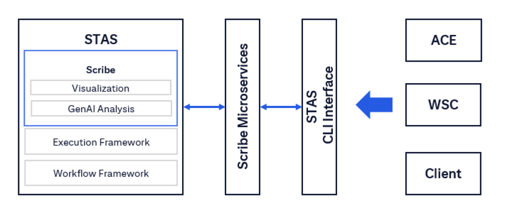

- Scribe is a module within STAS used to perform impact and variance analysis.  

- Recommended usage of the IA/VA platforms is to onboard to both orchestration and analysis.  

- STAS will be the centralized platform for executing and analyzing impact/variance analysis exercises.  

- Our services will be built within the STAS architecture and infrastructure.  

- The new Scribe services will be removable and independent but be optimized in order to attract users to onboard to STAS.

## Capabilities

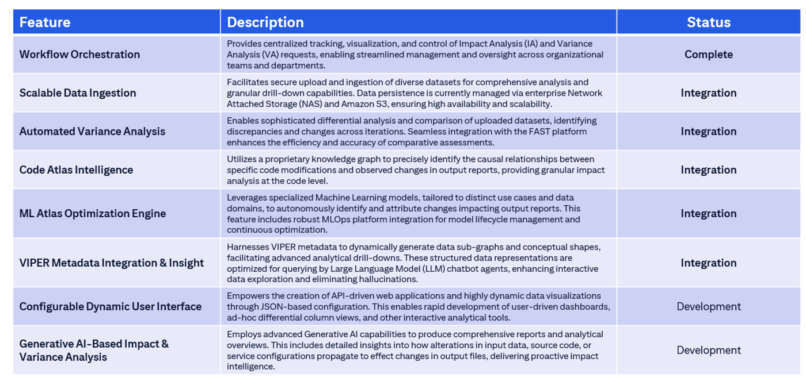

Feature table content如下：

- Workflow Orchestration  
  Provides centralized tracking, visualization, and control of Impact Analysis (IA) and Variance Analysis (VA) requests, enabling streamlined management and oversight across organizational teams and departments.  
  Status: Complete  

- Scalable Data Ingestion  
  Facilitates secure upload and ingestion of diverse datasets for comprehensive analysis and granular drill‑down capabilities. Data persistence is currently managed via enterprise Network Attached Storage (NAS) and Amazon S3, ensuring high availability and scalability.  
  Status: Integration  

- Automated Variance Analysis  
  Enables sophisticated differential analysis and comparison of uploaded datasets, identifying discrepancies and changes across iterations. Seamless integration with the FAST platform enhances the efficiency and accuracy of comparative assessments.  
  Status: Integration  

- Code Atlas Intelligence  
  Utilizes a proprietary knowledge graph to precisely identify the causal relationships between specific code modifications and observed changes in output reports, providing granular impact analysis at the code level.  
  Status: Integration  

- ML Atlas Optimization Engine  
  Leverages specialized Machine Learning models, tailored to distinct use cases and data domains, to autonomously identify and attribute changes impacting output reports. This feature includes robust MLOps platform integration for model lifecycle management and continuous optimization.  
  Status: Integration  

- VIPER Metadata Integration & Insight  
  Harnesses VIPER metadata to dynamically generate data sub‑graphs and conceptual shapes, facilitating advanced analytical drill‑downs. These structured data representations are optimized for querying by Large Language Model (LLM) chatbot agents, enhancing interactive data exploration and eliminating hallucinations.  
  Status: Integration  

- Configurable Dynamic User Interface  
  Empowers the creation of API‑driven web applications and highly dynamic data visualizations through JSON‑based configuration. This enables rapid development of user‑driven dashboards, ad‑hoc differential column views, and other interactive analytical tools.  
  Status: Development  

- Generative AI‑Based Impact & Variance Analysis  
  Employs advanced Generative AI capabilities to produce comprehensive reports and analytical overviews. This includes detailed insights into how alterations in input data, source code, or service configurations propagate to effect changes in output files, delivering proactive impact intelligence.  
  Status: Development

## Technology Components

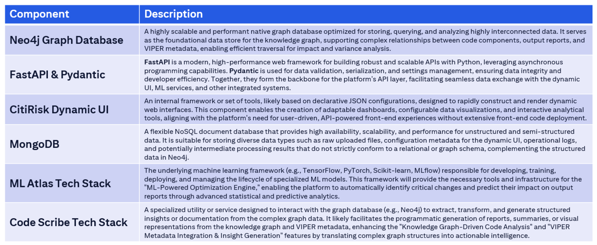

Component table內容如下：

- Neo4j Graph Database  
  A highly scalable and performant native graph database optimized for storing, querying, and analyzing highly interconnected data. It serves as the foundational data store for the knowledge graph, supporting complex relationships between code components, output reports, and VIPER metadata, enabling efficient traversal for impact and variance analysis.

- FastAPI & Pydantic  
  FastAPI is a modern, high-performance web framework for building robust and scalable APIs with Python, leveraging asynchronous programming capabilities. Pydantic is used for data validation, serialization, and settings management, ensuring data integrity and developer efficiency; together they form the backbone for the platform’s API layer, facilitating seamless data exchange with the dynamic UI, ML services, and other integrated systems.

- CitiRisk Dynamic UI  
  An internal framework or set of tools, likely based on declarative JSON configurations, designed to rapidly construct and render dynamic web interfaces. This component enables the creation of adaptable dashboards, configurable data visualizations, and interactive analytical tools, aligning with the platform’s need for user‑driven, API‑powered front‑end experiences without extensive front‑end code deployment.

- MongoDB  
  A flexible NoSQL document database that provides high availability, scalability, and performance for unstructured and semi‑structured data. It is suitable for storing diverse data types such as raw uploaded files, configuration metadata for the dynamic UI, operational logs, and potentially intermediate processing results that do not strictly conform to a relational or graph schema, complementing the structured data in Neo4j.

- ML Atlas Tech Stack  
  The underlying machine learning framework (e.g., TensorFlow, PyTorch, Scikit‑learn, MLflow) responsible for developing, training, deploying, and managing the lifecycle of specialized ML models. This framework will provide the necessary tools and infrastructure for the “ML‑Powered Optimization Engine,” enabling the platform to automatically identify critical changes and predict their impact on output reports through advanced statistical and predictive analytics.

- Code Scribe Tech Stack  
  A specialized utility or service designed to interact with the graph database (e.g., Neo4j) to extract, transform, and generate structured insights or documentation from the complex graph data. It likely facilitates the programmatic generation of reports, summaries, or visual representations from the knowledge graph and VIPER metadata, enhancing the “Knowledge Graph‑Driven Code Analysis” and “VIPER Metadata Integration & Insight Generation” features by translating complex graph structures into actionable intelligence.

## Capability Description [v0.2 VIPE Metadata Integration& Insight]

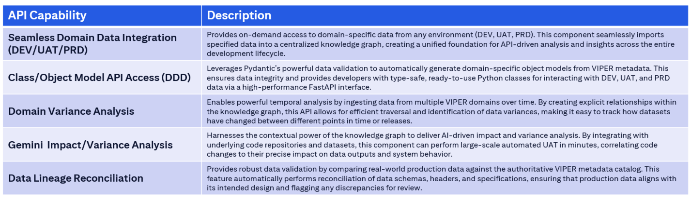

API Capability表內容如下：

- Seamless Domain Data Integration (DEV/UAT/PRD)  
  Provides on‑demand access to domain‑specific data from any environment (DEV, UAT, PRD). This component seamlessly imports specified data into a centralized knowledge graph, creating a unified foundation for API‑driven analysis and insights across the entire development lifecycle.  

- Class/Object Model API Access (DDD)  
  Leverages Pydantic’s powerful data validation to automatically generate domain‑specific object models from VIPER metadata. This ensures data integrity and provides developers with type‑safe, ready‑to‑use Python classes for interacting with DEV, UAT, and PRD data via a high‑performance FastAPI interface.  

- Domain Variance Analysis  
  Enables powerful temporal analysis by ingesting data from multiple VIPER domains over time. By creating explicit relationships within the knowledge graph, this API allows for efficient traversal and identification of data variances, making it easy to track how datasets have changed between different points in time or releases.  

- Gemini Impact/Variance Analysis  
  Harnesses the contextual power of the knowledge graph to deliver AI‑driven impact and variance analysis. By integrating with underlying code repositories and datasets, this component can perform large‑scale automated UAT in minutes, correlating code changes to their precise impact on data outputs and system behavior.  

- Data Lineage Reconciliation  
  Provides robust data validation by comparing real‑world production data against the authoritative VIPER metadata catalog. This feature automatically performs reconciliation of data schemas, headers, and specifications, ensuring that production data aligns with its intended design and flagging any discrepancies for review.

## Logical Architecture [v0.2 VIPER Metadata Integration & Insight]

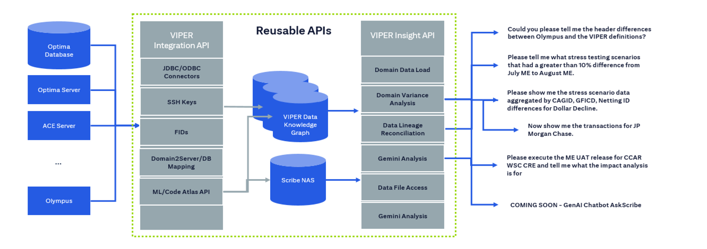

- Users can select a domain, get all available COBs or dates of available data and then load to a graph (for all available connectors).  

- VIPER Data Integration will go fetch the file/table/etc from the remote location and load automatically into a graph based on the VIPER domain model (SFTP).  

- VIPER Data Integration automatically retrieve from Postgres, files, and all other data source types once we create a VIPER mapping and infrastructure connectivity.  

- This data will be stored in Neo4j’s infinity graph across many servers and areas.  

- Users/applications/platforms can then query for data to be loaded/available and request generic analysis, such as variance, from the VIPER APIs.  

- Eventually everything will be upgraded to Redis, and we have not finished performance tuning.

## Architecture [v0.2 VIPER Metadata Integration & Insight]

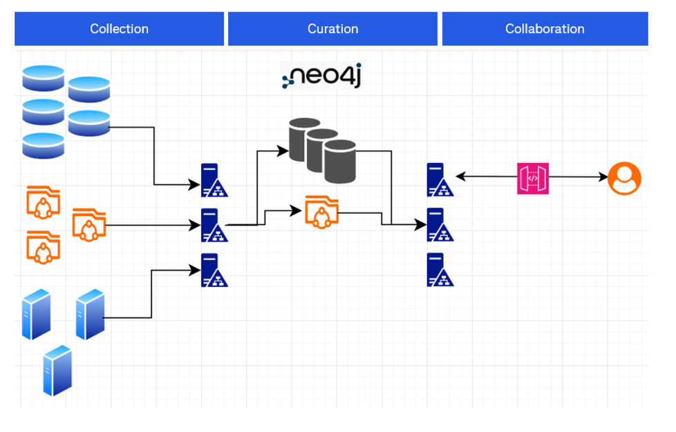

Recommended Infrastructure needed:

- Microservices infrastructure (e.g. ECS)  
- NAS file storage (e.g. S3)  
- UI infrastructure (e.g. CloudFront)  
- Neo4j InfiniGraph license  
- Secrets Manager  

- Show near-term servers and precise architecture diagram … deployment diagram

## API Used

Features / API / Use cases 內容如下：

Reconciliation Service:  
- Data Fetch / Data Header vs VIPER elements  
- API: `POST /api/v1/knowledgegraph/analysis/{workflow_id}/data_lineage_header_reconciliation`  
- Use case: Could you please tell me the header differences between Olympus and the VIPER definitions?  

Data Import:  
- File ingestion / Neo4j VIPER graph structure creation / Duplicate data import check  
- API: `POST /api/v1/data_import/import`  

Variance Analysis:  
- Domain Type Selection  
- Domain Name Selection  
- Period Selection  
- Aggregation Level Selection  
- CAGID Selection  
- GFCID Selection  
- NettingID Selection  
- Metrics Selection  
- Analysis Execution  

部分主要 APIs：  
- `POST /api/v1/variance-analysis/workflows/{workflow_id}/analyze`  
- `GET /api/v1/variance-analysis/workflows/{workflow_id}/domain-types`  
- `GET /api/v1/variance-analysis/workflows/{workflow_id}/domain-types/{domain_type}/domains`  
- `GET /api/v1/variance-analysis/workflows/{workflow_id}/domains/{domain_type}/{domain_name}/periods`  
- `GET /api/v1/variance-analysis/workflows/{workflow_id}/aggregation-levels`  
- `GET /api/v1/variance-analysis/workflows/{workflow_id}/domains/{domain_name}/cagids`  
- `GET /api/v1/variance-analysis/workflows/{workflow_id}/domains/{domain_type}/{domain_name}/cagids/{cagids}/gfcids`  
- `GET /api/v1/variance-analysis/workflows/{workflow_id}/domains/{domain_name}/metrics`  

示例用例：  
- Please tell me what stress testing scenarios had a greater than 10% difference from July ME to August ME.  
- Please show me the stress scenario data aggregated by CAGID, GFCID, Netting ID differences for Dollar Decline.  
- Now show me the transactions for JP Morgan Chase.

## Synapse Impact Analysis Architecture

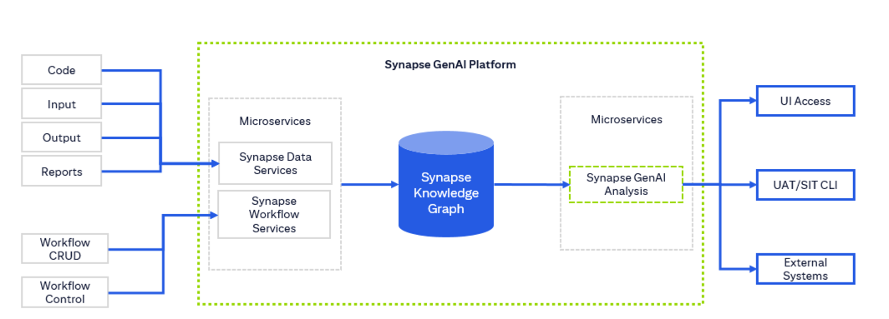

- The first step is to create a workflow.  
- The second is to upload as many data sets as possible or that is applicable to your analysis workflow.  
- After all this data is uploaded analysis requests can be made.  
- Analysis requests are asynchronous and may take time to complete.  

- Synapse Workflow Services are used to query workflow CRUD operations.  
- Synapse Data Services are used to upload and/or connect data sources to the workflow for ingestion and analysis.  
- Synapse Analysis is a way to query status, reports, and processing for impact/variance analysis.

##Synapse Impact Analysis Client Pre-Analysis Sequence Diagram

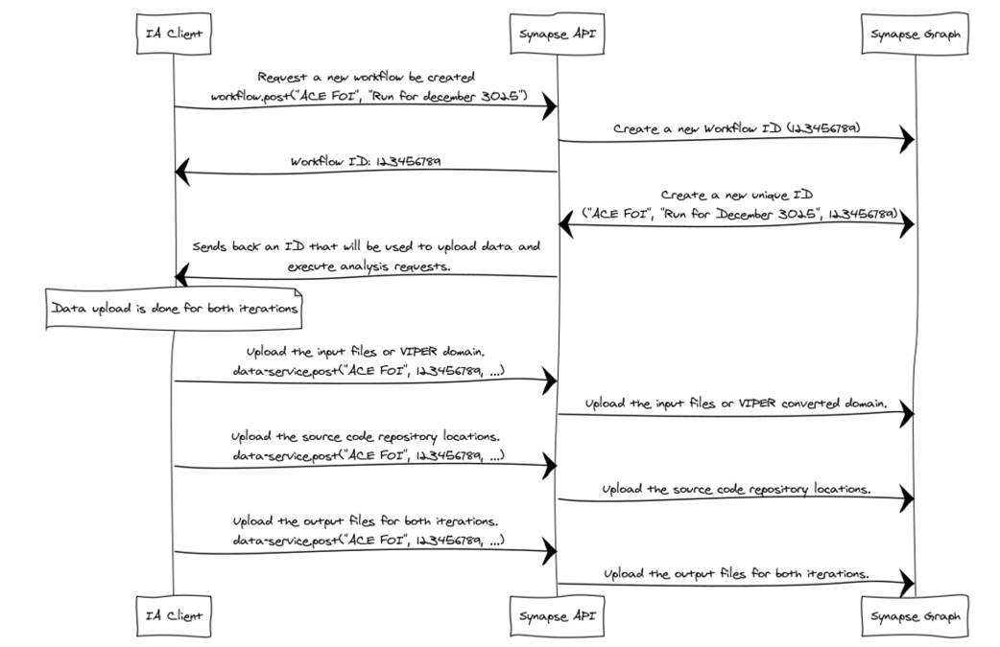

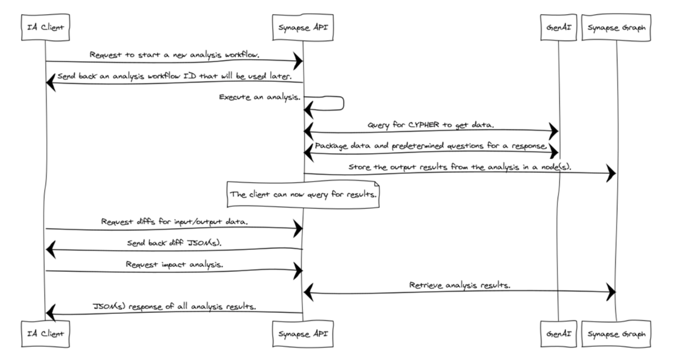

## Poc 1: VIPER driven GenAI Analysis

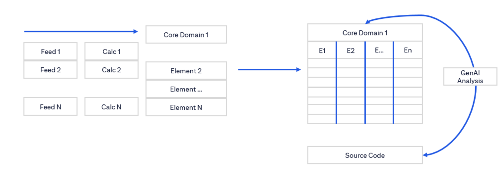

- For the PoC we are relying on the domain information in VIPER.  
- First we will pass in the domains for both the input/output files and the code.  
- Second we will use the domain information to retrieve the codebase as well as the input and output files.  

- GenAI will be used to correlate what differences in the code and input files caused the resultant output files to change.  
- There will also be a validation if the correction information is available with VIPER, which will increase precision and accuracy of the metadata.  
- Iterative process will bring precision to VIPER and the GenAI impact analysis exercise.

## Poc 2: Synapse Knowledge Graph Architecture

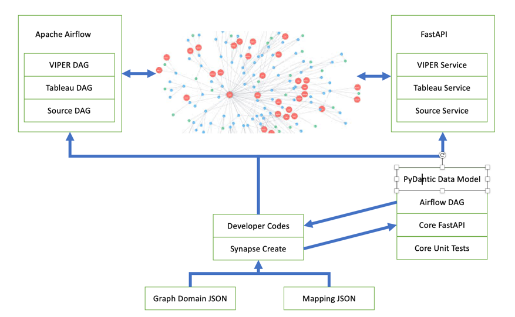

- Developer Assisted Code Generation  
- Common tools  
- SecDB pattern  

- Synapse Create will help the developer to create the core code needed to map 2‑dimensional data sources into Neo4j.  
- The developer will then start their coding and make modifications to the auto‑generated code as needed.

## Execution  vs  Analysis [5/6/2025]

Currently the IA applications that we are looking into are not only processing results but are also processing the execution of the code and the generating of the results. Also we have not found any platform that will automatically perform impact analysis. Our two options for architecture of the GenAI IA platform are shown below:

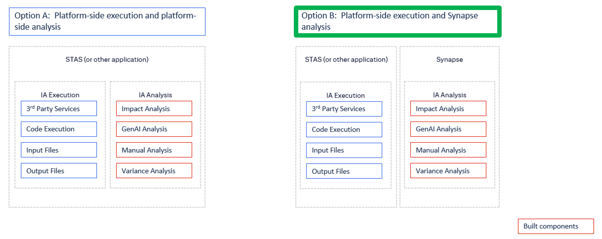
