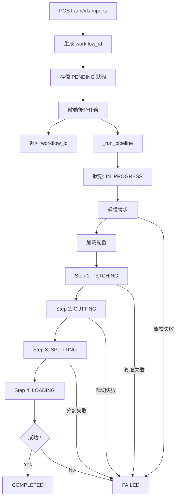

# /api/v1/imports 流程圖

## 概覽

此文檔描述了數據導入 API 端點 `/api/v1/imports` 的完整處理流程。

---

## API 請求流程

```
┌─────────────────────────────────────────────────────────────────────────────┐
│                        POST /api/v1/imports                                  │
│                                                                             │
│  Request Body:                                                              │
│  {                                                                          │
│    "domain_type": "API",                                                    │
│    "domain_name": "Credit Risk Transactions",                               │
│    "cob_date": "2024-09-01"                                                 │
│  }                                                                          │
└─────────────────────────────────────────────────────────────────────────────┘
                                      │
                                      ▼
┌─────────────────────────────────────────────────────────────────────────────┐
│  1. 生成 workflow_id (UUID)                                                  │
│  2. 存儲狀態: STATUSES[workflow_id] = {status: "pending"}                    │
│  3. 啟動後台任務: BackgroundTasks.add_task(_run_pipeline)                    │
│  4. 立即返回響應 ──────────────────────────────────────────────────────────► │
└─────────────────────────────────────────────────────────────────────────────┘
         │                                          返回: {"workflow_id": "uuid",
         │                                                  "status": "pending"}
         ▼
┌─────────────────────────────────────────────────────────────────────────────┐
│                        後台任務 _run_pipeline()                              │
└─────────────────────────────────────────────────────────────────────────────┘
         │
         ▼
┌─────────────────────────────────────────────────────────────────────────────┐
│  狀態更新: IN_PROGRESS                                                       │
│  創建 ImportRequest(domain_type, domain_name, cob_date)                      │
└─────────────────────────────────────────────────────────────────────────────┘
         │
         ▼
┌─────────────────────────────────────────────────────────────────────────────┐
│                         pipeline.run() 開始                                  │
└─────────────────────────────────────────────────────────────────────────────┘
         │
         ▼
┌─────────────────────────────────────────────────────────────────────────────┐
│  驗證請求 _validate_request()                                                │
│  ├── domain_type 必填                                                        │
│  ├── domain_name 必填                                                        │
│  └── cob_date 必填                                                           │
└─────────────────────────────────────────────────────────────────────────────┘
         │
         ▼
┌─────────────────────────────────────────────────────────────────────────────┐
│  加載配置                                                                    │
│  ├── settings_loader.load()        ← conf/settings.yaml                     │
│  ├── data_map_resolver.resolve()   ← conf/data_map.csv                      │
│  └── column_map_resolver.resolve() ← conf/column_map.yaml                   │
└─────────────────────────────────────────────────────────────────────────────┘
```

---

## Pipeline 四階段處理

```
         │
         ▼
╔═════════════════════════════════════════════════════════════════════════════╗
║  Step 1: FETCHING (獲取源文件)                                               ║
║  ─────────────────────────────────────────────────────────────────────────  ║
║  • 根據 connector_type 選擇連接器 (Linux/SFTP)                               ║
║  • 從遠程位置獲取文件到 DROPBOX_DIR                                           ║
║  • 記錄 bytes_fetched 到 metrics                                             ║
║                                                                             ║
║  相關文件: app/services/connectors.py                                        ║
╚═════════════════════════════════════════════════════════════════════════════╝
         │
         ▼
╔═════════════════════════════════════════════════════════════════════════════╗
║  Step 2: CUTTING (列裁切)                                                    ║
║  ─────────────────────────────────────────────────────────────────────────  ║
║  • 使用 ColumnCutter 提取指定列                                              ║
║  • 根據 column_map.yaml 的 required_columns_by_index                         ║
║  • 可選添加 CSV 標頭                                                         ║
║  • 使用 Unix `cut` 命令 (高效) 或 Python fallback                            ║
║                                                                             ║
║  相關文件: app/services/processors.py                                        ║
╚═════════════════════════════════════════════════════════════════════════════╝
         │
         ▼
╔═════════════════════════════════════════════════════════════════════════════╗
║  Step 3: SPLITTING (文件分割)                                                ║
║  ─────────────────────────────────────────────────────────────────────────  ║
║  • 使用 FileSplitter 按指定列分割                                            ║
║  • 通常按 GFCID 或 BOOK_ID 分割                                              ║
║  • 生成多個輸出文件                                                          ║
║  • 記錄 split_files_count 到 metrics                                         ║
║                                                                             ║
║  相關文件: app/services/processors.py                                        ║
╚═════════════════════════════════════════════════════════════════════════════╝
         │
         ▼
╔═════════════════════════════════════════════════════════════════════════════╗
║  Step 4: LOADING (加載到 Neo4j)                                              ║
║  ─────────────────────────────────────────────────────────────────────────  ║
║  • 使用 Neo4jLoader 批量加載                                                 ║
║  • LOAD CSV 語句                                                             ║
║  • MERGE Transaction 節點                                                    ║
║  • CREATE 與 Summary_GFCID 的關係                                            ║
║  • 每批 1000 行                                                              ║
║                                                                             ║
║  相關文件: app/services/neo4j_loader.py                                      ║
╚═════════════════════════════════════════════════════════════════════════════╝
         │
         ▼
    ┌────┴────┐
    │ 成功？  │
    └────┬────┘
    YES  │  NO
    ▼    │    ▼
┌────────┴────────┐     ┌─────────────────────────────────────┐
│ status: COMPLETED│     │ status: FAILED                      │
│ message: 成功訊息 │     │ message: 錯誤訊息                    │
└─────────────────┘     └─────────────────────────────────────┘
```

---

## 狀態流轉圖

```
PENDING ──► IN_PROGRESS ──► FETCHING ──► CUTTING ──► SPLITTING ──► LOADING ──► COMPLETED
                                                                                    │
                                                                                    │
            ◄───────────────────── 任何步驟失敗 ────────────────────────────────────►
                                        │
                                        ▼
                                     FAILED
```

### WorkflowStatus 枚舉值

| 狀態 | 說明 |
|------|------|
| `pending` | 等待處理 |
| `in_progress` | 處理中 |
| `fetching` | 正在獲取文件 |
| `cutting` | 正在裁切列 |
| `splitting` | 正在分割文件 |
| `loading` | 正在加載到 Neo4j |
| `completed` | 處理完成 |
| `failed` | 處理失敗 |

---

## 查詢狀態 API

```
GET /api/v1/imports/{workflow_id}
         │
         ▼
   ┌─────────────┐
   │ 查找 STATUSES│
   └─────────────┘
         │
    ┌────┴────┐
    │ 存在？  │
    └────┬────┘
    YES  │  NO
    ▼    │    ▼
┌────────┴───────┐     ┌─────────────────┐
│ 返回 ImportStatus │     │ 404 Not Found   │
│ {workflow_id,    │     └─────────────────┘
│  status, detail} │
└─────────────────┘
```

### 響應範例

**成功響應:**
```json
{
  "workflow_id": "550e8400-e29b-41d4-a716-446655440000",
  "status": "completed",
  "detail": "Successfully processed Credit Risk Transactions for 20240901"
}
```

**失敗響應:**
```json
{
  "workflow_id": "550e8400-e29b-41d4-a716-446655440000",
  "status": "failed",
  "detail": "Failed to fetch source file"
}
```

---

## 相關文件

| 文件 | 說明 |
|------|------|
| `app/api/data_import.py` | API 路由定義 |
| `app/services/import_pipeline.py` | Pipeline 編排邏輯 |
| `app/services/connectors.py` | 文件獲取連接器 |
| `app/services/processors.py` | 列裁切與文件分割 |
| `app/services/neo4j_loader.py` | Neo4j 數據加載 |
| `app/models/imports.py` | 數據模型定義 |
| `conf/settings.yaml` | 應用配置 |
| `conf/column_map.yaml` | 列映射配置 |
| `conf/data_map.csv` | 數據源映射 |

---

## Mermaid 流程圖

