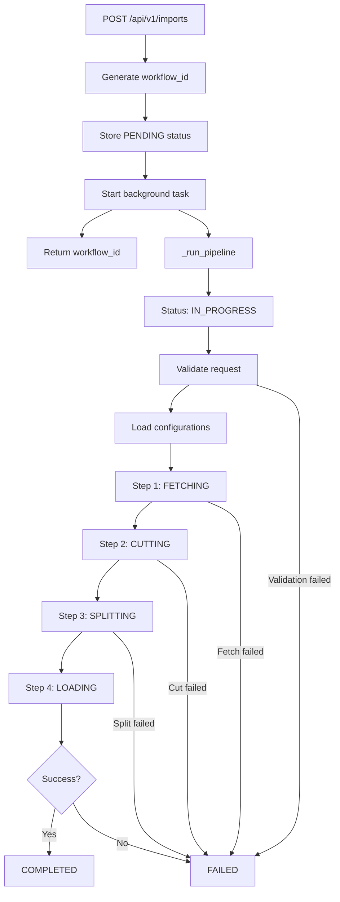
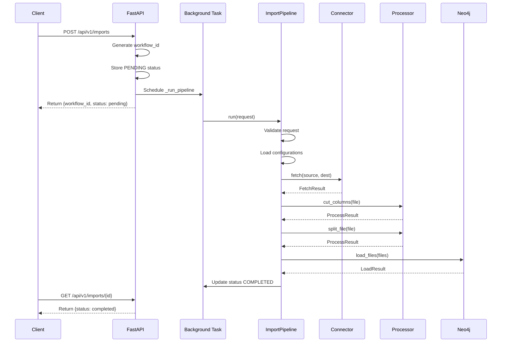

# /api/v1/imports Flowchart

## Overview

This document describes the complete processing flow of the data import API endpoint `/api/v1/imports`.

---

## API Description

### Purpose
This is a **Data Import API** used to import external data files into a Neo4j graph database.

### Endpoints

| Method | Path | Description |
|--------|------|-------------|
| `POST` | `/api/v1/imports` | Submit an import job |
| `GET` | `/api/v1/imports/{workflow_id}` | Query job status |

### POST `/api/v1/imports`

**Request Parameters:**
```json
{
  "domain_type": "API",           // Domain type (API, CORE, CURATED, etc.)
  "domain_name": "Credit Risk",   // Domain name
  "cob_date": "2024-09-01"        // Close of Business Date
}
```

**Processing Steps:**
1. **Fetch** - Retrieve source file from remote (Linux/SFTP)
2. **Cut** - Extract required columns
3. **Split** - Split into multiple files by GFCID
4. **Load** - Batch load into Neo4j

**Response:**
```json
{
  "workflow_id": "550e8400-e29b-41d4-a716-446655440000",
  "status": "pending"
}
```

### GET `/api/v1/imports/{workflow_id}`

**Query import job status:**
```json
{
  "workflow_id": "550e8400-...",
  "status": "completed",          // pending, fetching, cutting, splitting, loading, completed, failed
  "detail": "Successfully processed..."
}
```

### Key Features
- **Asynchronous Processing** - API returns immediately, import runs in background
- **Status Tracking** - Query job progress at any time
- **Four-Stage Pipeline** - Fetch → Cut → Split → Load

---

## API Request Flow

```
┌─────────────────────────────────────────────────────────────────────────────┐
│                        POST /api/v1/imports                                  │
│                                                                             │
│  Request Body:                                                              │
│  {                                                                          │
│    "domain_type": "API",                                                    │
│    "domain_name": "Credit Risk Transactions",                               │
│    "cob_date": "2024-09-01"                                                 │
│  }                                                                          │
└─────────────────────────────────────────────────────────────────────────────┘
                                      │
                                      ▼
┌─────────────────────────────────────────────────────────────────────────────┐
│  1. Generate workflow_id (UUID)                                              │
│  2. Store status: STATUSES[workflow_id] = {status: "pending"}                │
│  3. Start background task: BackgroundTasks.add_task(_run_pipeline)           │
│  4. Return response immediately ───────────────────────────────────────────► │
└─────────────────────────────────────────────────────────────────────────────┘
         │                                          Returns: {"workflow_id": "uuid",
         │                                                     "status": "pending"}
         ▼
┌─────────────────────────────────────────────────────────────────────────────┐
│                      Background Task _run_pipeline()                         │
└─────────────────────────────────────────────────────────────────────────────┘
         │
         ▼
┌─────────────────────────────────────────────────────────────────────────────┐
│  Update status: IN_PROGRESS                                                  │
│  Create ImportRequest(domain_type, domain_name, cob_date)                    │
└─────────────────────────────────────────────────────────────────────────────┘
         │
         ▼
┌─────────────────────────────────────────────────────────────────────────────┐
│                         pipeline.run() starts                                │
└─────────────────────────────────────────────────────────────────────────────┘
         │
         ▼
┌─────────────────────────────────────────────────────────────────────────────┐
│  Validate request _validate_request()                                        │
│  ├── domain_type required                                                    │
│  ├── domain_name required                                                    │
│  └── cob_date required                                                       │
└─────────────────────────────────────────────────────────────────────────────┘
         │
         ▼
┌─────────────────────────────────────────────────────────────────────────────┐
│  Load configurations                                                         │
│  ├── settings_loader.load()        ← conf/settings.yaml                     │
│  ├── data_map_resolver.resolve()   ← conf/data_map.csv                      │
│  └── column_map_resolver.resolve() ← conf/column_map.yaml                   │
└─────────────────────────────────────────────────────────────────────────────┘
```

---

## Pipeline Four-Stage Processing

```
         │
         ▼
╔═════════════════════════════════════════════════════════════════════════════╗
║  Step 1: FETCHING (Retrieve Source File)                                     ║
║  ─────────────────────────────────────────────────────────────────────────  ║
║  • Select connector based on connector_type (Linux/SFTP)                     ║
║  • Fetch file from remote location to DROPBOX_DIR                            ║
║  • Record bytes_fetched in metrics                                           ║
║                                                                             ║
║  Related file: app/services/connectors.py                                    ║
╚═════════════════════════════════════════════════════════════════════════════╝
         │
         ▼
╔═════════════════════════════════════════════════════════════════════════════╗
║  Step 2: CUTTING (Column Extraction)                                         ║
║  ─────────────────────────────────────────────────────────────────────────  ║
║  • Use ColumnCutter to extract specified columns                             ║
║  • Based on required_columns_by_index from column_map.yaml                   ║
║  • Optionally add CSV headers                                                ║
║  • Uses Unix `cut` command (efficient) or Python fallback                    ║
║                                                                             ║
║  Related file: app/services/processors.py                                    ║
╚═════════════════════════════════════════════════════════════════════════════╝
         │
         ▼
╔═════════════════════════════════════════════════════════════════════════════╗
║  Step 3: SPLITTING (File Splitting)                                          ║
║  ─────────────────────────────────────────────────────────────────────────  ║
║  • Use FileSplitter to split by specified column                             ║
║  • Typically splits by GFCID or BOOK_ID                                      ║
║  • Generates multiple output files                                           ║
║  • Record split_files_count in metrics                                       ║
║                                                                             ║
║  Related file: app/services/processors.py                                    ║
╚═════════════════════════════════════════════════════════════════════════════╝
         │
         ▼
╔═════════════════════════════════════════════════════════════════════════════╗
║  Step 4: LOADING (Load to Neo4j)                                             ║
║  ─────────────────────────────────────────────────────────────────────────  ║
║  • Use Neo4jLoader for batch loading                                         ║
║  • Execute LOAD CSV statements                                               ║
║  • MERGE Transaction nodes                                                   ║
║  • CREATE relationships with Summary_GFCID                                   ║
║  • Batch size: 1000 rows per transaction                                     ║
║                                                                             ║
║  Related file: app/services/neo4j_loader.py                                  ║
╚═════════════════════════════════════════════════════════════════════════════╝
         │
         ▼
    ┌────┴────┐
    │ Success?│
    └────┬────┘
    YES  │  NO
    ▼    │    ▼
┌────────┴────────┐     ┌─────────────────────────────────────┐
│ status: COMPLETED│     │ status: FAILED                      │
│ message: Success │     │ message: Error details               │
└─────────────────┘     └─────────────────────────────────────┘
```

---

## Status Transition Diagram

```
PENDING ──► IN_PROGRESS ──► FETCHING ──► CUTTING ──► SPLITTING ──► LOADING ──► COMPLETED
                                                                                    │
                                                                                    │
            ◄─────────────────────── Any step fails ────────────────────────────────►
                                        │
                                        ▼
                                     FAILED
```

### WorkflowStatus Enum Values

| Status | Description |
|--------|-------------|
| `pending` | Waiting to be processed |
| `in_progress` | Currently processing |
| `fetching` | Retrieving source file |
| `cutting` | Extracting columns |
| `splitting` | Splitting file |
| `loading` | Loading to Neo4j |
| `completed` | Processing completed successfully |
| `failed` | Processing failed |

---

## Query Status API

```
GET /api/v1/imports/{workflow_id}
         │
         ▼
   ┌─────────────┐
   │ Look up     │
   │ STATUSES    │
   └─────────────┘
         │
    ┌────┴────┐
    │ Exists? │
    └────┬────┘
    YES  │  NO
    ▼    │    ▼
┌────────┴───────┐     ┌─────────────────┐
│ Return          │     │ 404 Not Found   │
│ ImportStatus    │     └─────────────────┘
│ {workflow_id,   │
│  status, detail}│
└─────────────────┘
```

### Response Examples

**Success Response:**
```json
{
  "workflow_id": "550e8400-e29b-41d4-a716-446655440000",
  "status": "completed",
  "detail": "Successfully processed Credit Risk Transactions for 20240901"
}
```

**Failure Response:**
```json
{
  "workflow_id": "550e8400-e29b-41d4-a716-446655440000",
  "status": "failed",
  "detail": "Failed to fetch source file"
}
```

**In Progress Response:**
```json
{
  "workflow_id": "550e8400-e29b-41d4-a716-446655440000",
  "status": "cutting",
  "detail": null
}
```

---

## Related Files

| File | Description |
|------|-------------|
| `app/api/data_import.py` | API route definitions |
| `app/services/import_pipeline.py` | Pipeline orchestration logic |
| `app/services/connectors.py` | File fetching connectors |
| `app/services/processors.py` | Column cutting and file splitting |
| `app/services/neo4j_loader.py` | Neo4j data loading |
| `app/models/imports.py` | Data model definitions |
| `conf/settings.yaml` | Application configuration |
| `conf/column_map.yaml` | Column mapping configuration |
| `conf/data_map.csv` | Data source mapping |

---

## Architecture Diagram

```
┌─────────────────────────────────────────────────────────────────────────────┐
│                              API Layer                                       │
│                         (app/api/data_import.py)                            │
│                                                                             │
│  POST /api/v1/imports          GET /api/v1/imports/{workflow_id}            │
└─────────────────────────────────────────────────────────────────────────────┘
                                      │
                                      ▼
┌─────────────────────────────────────────────────────────────────────────────┐
│                           Service Layer                                      │
│                    (app/services/import_pipeline.py)                        │
│                                                                             │
│                          ImportPipeline.run()                               │
└─────────────────────────────────────────────────────────────────────────────┘
                                      │
            ┌─────────────────────────┼─────────────────────────┐
            ▼                         ▼                         ▼
┌───────────────────┐   ┌───────────────────┐   ┌───────────────────┐
│    Connectors     │   │    Processors     │   │    Neo4jLoader    │
│  (connectors.py)  │   │  (processors.py)  │   │ (neo4j_loader.py) │
│                   │   │                   │   │                   │
│ • LinuxConnector  │   │ • ColumnCutter    │   │ • LOAD CSV        │
│ • SFTPConnector   │   │ • FileSplitter    │   │ • Batch insert    │
└───────────────────┘   └───────────────────┘   └───────────────────┘
            │                         │                         │
            ▼                         ▼                         ▼
┌───────────────────┐   ┌───────────────────┐   ┌───────────────────┐
│   Remote Files    │   │   Local Files     │   │      Neo4j        │
│  (Linux/SFTP)     │   │  (DROPBOX_DIR)    │   │  Graph Database   │
└───────────────────┘   └───────────────────┘   └───────────────────┘
```

---

## Mermaid Flowchart



---

## Sequence Diagram


