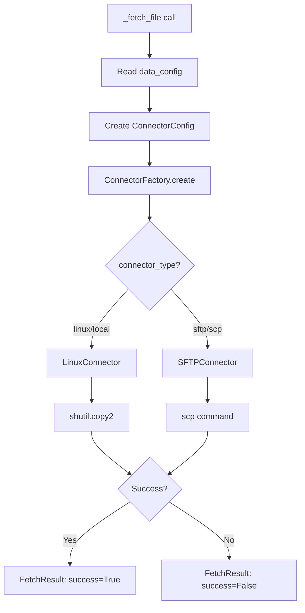
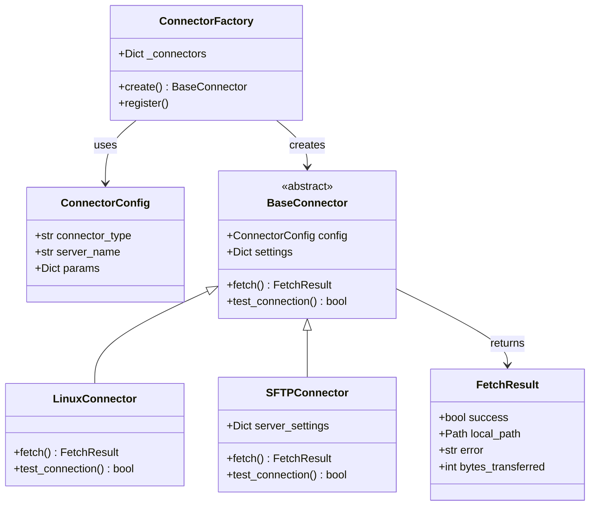
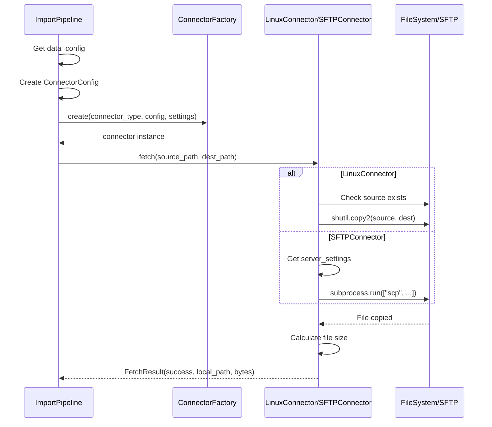

# Connector Flowchart

## Overview

This document describes the complete processing flow of the data connector module (`app/services/connectors.py`).

---

## Description

### Purpose
The Connector module is responsible for fetching files from various data sources, supporting local filesystem and remote SFTP transfers.

### Supported Connector Types

| Type | Class | Use Case |
|------|-------|----------|
| `linux` / `local` | `LinuxConnector` | Local filesystem, mounted NAS |
| `sftp` / `scp` | `SFTPConnector` | Remote SSH/SFTP servers |

---

## Main Flow

```
┌─────────────────────────────────────────────────────────────────────────────┐
│                         _fetch_file() Entry Point                            │
│                    (app/services/import_pipeline.py:263)                     │
└─────────────────────────────────────────────────────────────────────────────┘
                                      │
                                      ▼
┌─────────────────────────────────────────────────────────────────────────────┐
│  Get configuration from data_config                                          │
│  ├── connector_type: "linux" | "sftp"                                       │
│  ├── connector_params: {server_name: "..."}                                 │
│  └── source_file_path_template: "/path/to/{cob_date}/file.csv"              │
└─────────────────────────────────────────────────────────────────────────────┘
                                      │
                                      ▼
┌─────────────────────────────────────────────────────────────────────────────┐
│  Create ConnectorConfig                                                      │
│  ConnectorConfig(                                                           │
│      connector_type = "linux" | "sftp",                                     │
│      server_name = "server1",                                               │
│      params = {...}                                                         │
│  )                                                                          │
└─────────────────────────────────────────────────────────────────────────────┘
                                      │
                                      ▼
╔═════════════════════════════════════════════════════════════════════════════╗
║                         ConnectorFactory.create()                            ║
║                        (connectors.py:184-190)                              ║
╚═════════════════════════════════════════════════════════════════════════════╝
                                      │
                    ┌─────────────────┴─────────────────┐
                    │                                   │
          connector_type?                      connector_type?
          "linux" | "local"                    "sftp" | "scp"
                    │                                   │
                    ▼                                   ▼
┌───────────────────────────────┐     ┌───────────────────────────────┐
│       LinuxConnector          │     │       SFTPConnector           │
│      (connectors.py:63)       │     │      (connectors.py:98)       │
│                               │     │                               │
│  Used for:                    │     │  Used for:                    │
│  • Local filesystem           │     │  • Remote SSH/SFTP servers    │
│  • Mounted NAS                │     │  • Authenticated remote hosts │
└───────────────────────────────┘     └───────────────────────────────┘
                    │                                   │
                    ▼                                   ▼
┌───────────────────────────────┐     ┌───────────────────────────────┐
│        connector.fetch()      │     │        connector.fetch()      │
└───────────────────────────────┘     └───────────────────────────────┘
                    │                                   │
                    ▼                                   ▼
            ┌───────────────────────────────────────────────┐
            │                 FetchResult                   │
            │  { success, local_path, bytes_transferred }   │
            └───────────────────────────────────────────────┘
```

---

## LinuxConnector.fetch() Flow

```
┌─────────────────────────────────────────────────────────────────────────────┐
│                    LinuxConnector.fetch(source, dest)                        │
│                         (connectors.py:66-91)                               │
└─────────────────────────────────────────────────────────────────────────────┘
                                      │
                                      ▼
                              ┌───────────────┐
                              │ source exists?│
                              └───────┬───────┘
                               NO     │     YES
                                ▼     │      ▼
┌────────────────────────┐           │     ┌────────────────────────┐
│ FetchResult(           │           │     │ Create dest directory  │
│   success=False,       │           │     │ dest.parent.mkdir()    │
│   error="not found"    │           │     └────────────────────────┘
│ )                      │           │                  │
└────────────────────────┘           │                  ▼
                                     │     ┌────────────────────────┐
                                     │     │ shutil.copy2()         │
                                     │     │ Copy file (preserve    │
                                     │     │ metadata)              │
                                     │     └────────────────────────┘
                                     │                  │
                                     │                  ▼
                                     │     ┌────────────────────────┐
                                     │     │ Calculate file size    │
                                     │     │ file_size = stat().size│
                                     │     └────────────────────────┘
                                     │                  │
                                     │                  ▼
                                     │     ┌────────────────────────┐
                                     │     │ FetchResult(           │
                                     │     │   success=True,        │
                                     │     │   local_path=dest,     │
                                     │     │   bytes_transferred    │
                                     │     │ )                      │
                                     │     └────────────────────────┘
                                     │
                              ┌──────┴───────┐
                              │  Exception?  │
                              └──────┬───────┘
                                     ▼
                        ┌────────────────────────┐
                        │ FetchResult(           │
                        │   success=False,       │
                        │   error=str(e)         │
                        │ )                      │
                        └────────────────────────┘
```

---

## SFTPConnector.fetch() Flow

```
┌─────────────────────────────────────────────────────────────────────────────┐
│                    SFTPConnector.fetch(source, dest)                         │
│                         (connectors.py:118-155)                             │
└─────────────────────────────────────────────────────────────────────────────┘
                                      │
                                      ▼
┌─────────────────────────────────────────────────────────────────────────────┐
│  _get_server_settings()                                                      │
│  Get credentials from settings.yaml LINUX_SERVERS                            │
│  { user: "username", password: "xxx", ... }                                 │
└─────────────────────────────────────────────────────────────────────────────┘
                                      │
                              ┌───────┴────────┐
                              │ settings exist?│
                              └───────┬────────┘
                               NO     │     YES
                                ▼     │      ▼
┌────────────────────────┐           │     ┌────────────────────────┐
│ FetchResult(           │           │     │ Create dest directory  │
│   success=False,       │           │     │ dest.parent.mkdir()    │
│   error="No settings"  │           │     └────────────────────────┘
│ )                      │           │                  │
└────────────────────────┘           │                  ▼
                                     │     ┌────────────────────────┐
                                     │     │ Build SCP command      │
                                     │     │ ["scp",                │
                                     │     │  "user@host:source",   │
                                     │     │  "dest"]               │
                                     │     └────────────────────────┘
                                     │                  │
                                     │                  ▼
                                     │     ┌────────────────────────┐
                                     │     │ subprocess.run()       │
                                     │     │ timeout=300 seconds    │
                                     │     └────────────────────────┘
                                     │                  │
                                     │         ┌───────┴───────┐
                                     │         │ returncode=0? │
                                     │         └───────┬───────┘
                                     │          NO     │     YES
                                     │           ▼     │      ▼
                                     │  ┌──────────────┤     ┌────────────────────────┐
                                     │  │ FetchResult( │     │ FetchResult(           │
                                     │  │  success=    │     │   success=True,        │
                                     │  │   False,     │     │   local_path=dest,     │
                                     │  │  error=      │     │   bytes_transferred    │
                                     │  │   stderr     │     │ )                      │
                                     │  │ )            │     └────────────────────────┘
                                     │  └──────────────┘
                                     │
                              ┌──────┴───────┐
                              │   Timeout?   │
                              └──────┬───────┘
                                     ▼
                        ┌────────────────────────┐
                        │ FetchResult(           │
                        │   success=False,       │
                        │   error="timed out"    │
                        │ )                      │
                        └────────────────────────┘
```

---

## Class Relationship Diagram

```
                    ┌─────────────────────┐
                    │   ConnectorConfig   │
                    │   (dataclass)       │
                    ├─────────────────────┤
                    │ connector_type: str │
                    │ server_name: str    │
                    │ params: Dict        │
                    └─────────────────────┘
                              │
                              │ passed to
                              ▼
                    ┌─────────────────────┐
                    │  ConnectorFactory   │
                    ├─────────────────────┤
                    │ _connectors = {     │
                    │   "linux": Linux,   │
                    │   "sftp": SFTP      │
                    │ }                   │
                    ├─────────────────────┤
                    │ create()            │
                    │ register()          │
                    └─────────────────────┘
                              │
                              │ creates
                              ▼
                    ┌─────────────────────┐
                    │   BaseConnector     │
                    │   (ABC abstract)    │
                    ├─────────────────────┤
                    │ config              │
                    │ settings            │
                    ├─────────────────────┤
                    │ fetch() [abstract]  │
                    │ test_connection()   │
                    └─────────────────────┘
                              △
                              │ inherits
              ┌───────────────┴───────────────┐
              │                               │
┌─────────────────────┐         ┌─────────────────────┐
│   LinuxConnector    │         │   SFTPConnector     │
├─────────────────────┤         ├─────────────────────┤
│                     │         │ server_settings     │
├─────────────────────┤         ├─────────────────────┤
│ fetch()             │         │ fetch()             │
│  └─ shutil.copy2()  │         │  └─ scp command     │
│ test_connection()   │         │ test_connection()   │
│  └─ return True     │         │  └─ ssh test        │
└─────────────────────┘         └─────────────────────┘
              │                               │
              │                               │
              ▼                               ▼
┌─────────────────────┐         ┌─────────────────────┐
│    FetchResult      │         │    FetchResult      │
│    (dataclass)      │         │    (dataclass)      │
├─────────────────────┤         ├─────────────────────┤
│ success: bool       │         │ success: bool       │
│ local_path: Path    │         │ local_path: Path    │
│ error: str          │         │ error: str          │
│ bytes_transferred   │         │ bytes_transferred   │
└─────────────────────┘         └─────────────────────┘
```

---

## Configuration Resolution Flow

```
┌─────────────────────────────────────────────────────────────────────────────┐
│                            DataMapResolver                                   │
│                         (connectors.py:198-244)                             │
└─────────────────────────────────────────────────────────────────────────────┘
                                      │
                                      │ reads
                                      ▼
┌─────────────────────────────────────────────────────────────────────────────┐
│                          conf/data_map.csv                                   │
├─────────────────────────────────────────────────────────────────────────────┤
│ domain_type │ domain_name │ connector_type │ source_file_path_template      │
├─────────────┼─────────────┼────────────────┼────────────────────────────────┤
│ API         │ Credit Risk │ linux          │ /mnt/nas/{cob_date}/credit.csv │
│ CORE        │ Market Data │ sftp           │ /data/{cob_date}/market.csv    │
└─────────────────────────────────────────────────────────────────────────────┘
                                      │
                                      │ returns
                                      ▼
                        { connector_type, source_file_path_template, ... }
```

---

## Related Files

| File | Description |
|------|-------------|
| `app/services/connectors.py` | Connector implementation |
| `app/services/import_pipeline.py` | Pipeline calling Connector |
| `conf/settings.yaml` | SFTP server credentials |
| `conf/data_map.csv` | Domain to Connector mapping |

---

## Mermaid Flowchart





---

## Sequence Diagram


