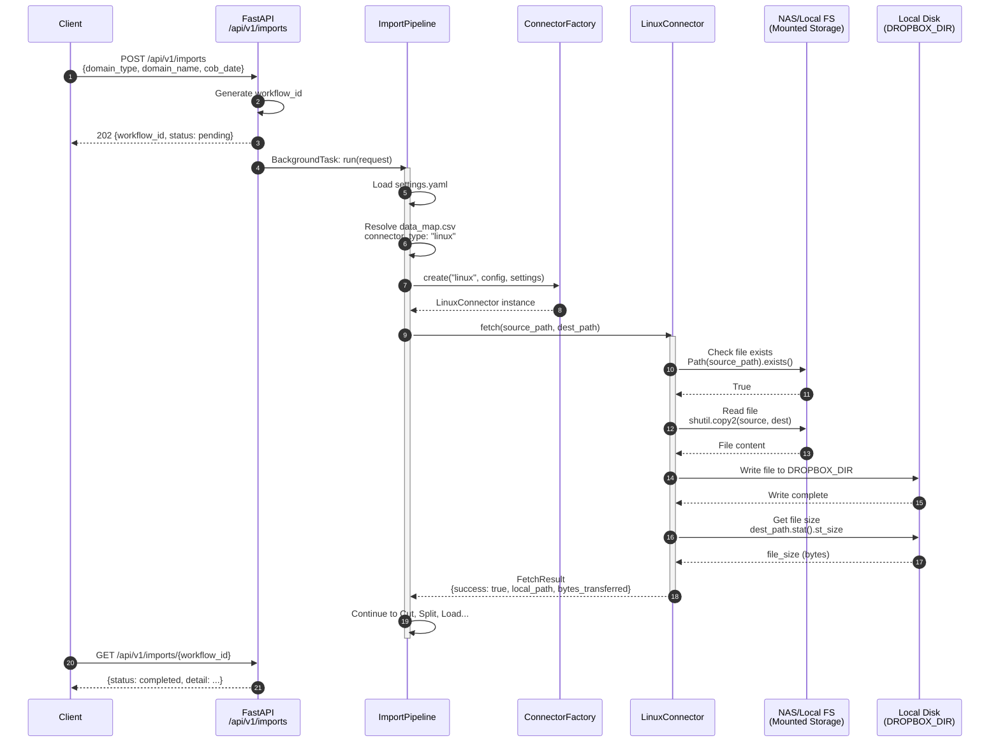
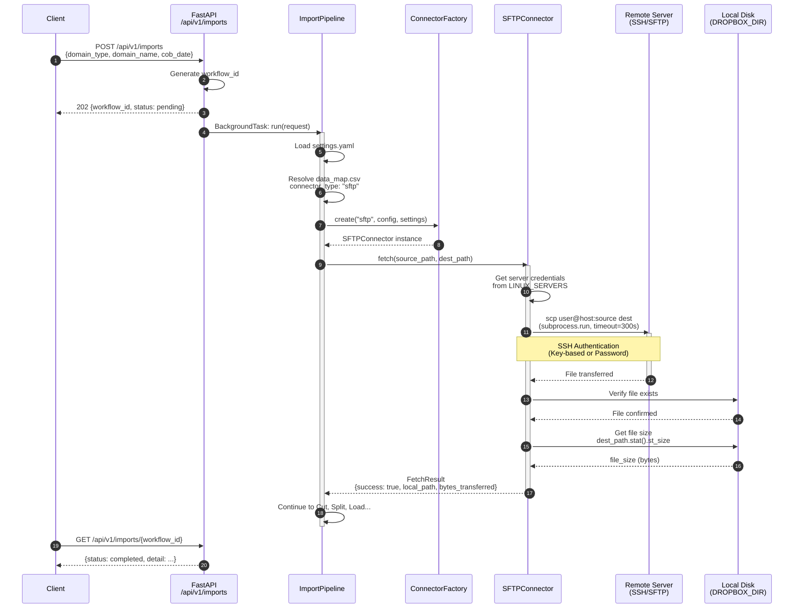
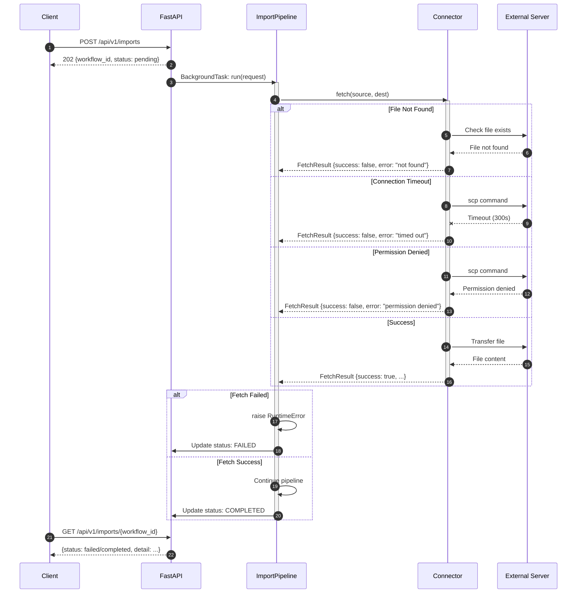

# Connector Sequence Diagram

## 概覽

此文檔展示 Connector 模組與外部伺服器之間的交互時序圖。

---

## 完整交互流程

```
┌──────────┐     ┌──────────┐     ┌──────────────┐     ┌─────────────┐     ┌──────────────┐
│  Client  │     │ FastAPI  │     │ImportPipeline│     │  Connector  │     │External Server│
│          │     │          │     │              │     │             │     │(NAS/SFTP)    │
└────┬─────┘     └────┬─────┘     └──────┬───────┘     └──────┬──────┘     └──────┬───────┘
     │                │                  │                    │                   │
     │ POST /imports  │                  │                    │                   │
     │───────────────>│                  │                    │                   │
     │                │                  │                    │                   │
     │                │ BackgroundTask   │                    │                   │
     │                │─────────────────>│                    │                   │
     │                │                  │                    │                   │
     │ 202 Accepted   │                  │                    │                   │
     │<───────────────│                  │                    │                   │
     │                │                  │                    │                   │
     │                │                  │ _fetch_file()      │                   │
     │                │                  │───────────────────>│                   │
     │                │                  │                    │                   │
     │                │                  │                    │ fetch(src, dest)  │
     │                │                  │                    │──────────────────>│
     │                │                  │                    │                   │
     │                │                  │                    │   File Content    │
     │                │                  │                    │<──────────────────│
     │                │                  │                    │                   │
     │                │                  │    FetchResult     │                   │
     │                │                  │<───────────────────│                   │
     │                │                  │                    │                   │
     │                │                  │ (continue to Cut,  │                   │
     │                │                  │  Split, Load...)   │                   │
     │                │                  │                    │                   │
     │ GET /imports/{id}                 │                    │                   │
     │───────────────>│                  │                    │                   │
     │                │                  │                    │                   │
     │   Status       │                  │                    │                   │
     │<───────────────│                  │                    │                   │
     │                │                  │                    │                   │
```

---

## LinuxConnector 時序圖



---

## SFTPConnector 時序圖



---

## 錯誤處理時序圖



---

## 系統架構圖

```
                                    ┌─────────────────────────────────────────┐
                                    │           External Systems              │
                                    ├─────────────────────────────────────────┤
                                    │                                         │
                                    │   ┌─────────────┐   ┌─────────────┐    │
                                    │   │  NAS/Mount  │   │ SFTP Server │    │
                                    │   │  Storage    │   │ (Remote)    │    │
                                    │   └──────┬──────┘   └──────┬──────┘    │
                                    │          │                 │           │
                                    └──────────┼─────────────────┼───────────┘
                                               │                 │
                              ┌────────────────┴─────────────────┴────────────────┐
                              │                    Network                         │
                              └────────────────────────────┬──────────────────────┘
                                                           │
┌─────────────────────────────────────────────────────────────────────────────────────────┐
│                              Microservice (Data Import)                                  │
├─────────────────────────────────────────────────────────────────────────────────────────┤
│                                                                                         │
│   ┌─────────────┐      ┌──────────────────┐      ┌─────────────────────────────────┐   │
│   │   Client    │      │    FastAPI       │      │        Service Layer            │   │
│   │  (Browser/  │─────>│  /api/v1/imports │─────>│                                 │   │
│   │   Postman)  │      │                  │      │  ┌───────────────────────────┐  │   │
│   └─────────────┘      └──────────────────┘      │  │     ImportPipeline        │  │   │
│                                                   │  │                           │  │   │
│                                                   │  │  ┌─────────────────────┐  │  │   │
│                                                   │  │  │  ConnectorFactory   │  │  │   │
│                                                   │  │  └──────────┬──────────┘  │  │   │
│                                                   │  │             │             │  │   │
│                                                   │  │     ┌───────┴───────┐     │  │   │
│                                                   │  │     │               │     │  │   │
│                                                   │  │  ┌──▼────┐    ┌─────▼──┐  │  │   │
│                                                   │  │  │Linux  │    │ SFTP   │  │  │   │
│                                                   │  │  │Connec.│    │Connec. │  │  │   │
│                                                   │  │  └───┬───┘    └───┬────┘  │  │   │
│                                                   │  │      │            │       │  │   │
│                                                   │  └──────┼────────────┼───────┘  │   │
│                                                   └─────────┼────────────┼──────────┘   │
│                                                             │            │              │
│   ┌─────────────────────────────────────────────────────────┼────────────┼───────────┐  │
│   │                      Local Storage                      │            │           │  │
│   │                                                         ▼            ▼           │  │
│   │   ┌─────────────────────────────────────────────────────────────────────────┐   │  │
│   │   │                        DROPBOX_DIR                                       │   │  │
│   │   │                    /Users/.../mnt/nas/                                   │   │  │
│   │   │                                                                          │   │  │
│   │   │   ┌──────────┐  ┌──────────┐  ┌──────────┐  ┌──────────┐               │   │  │
│   │   │   │ fetched  │  │   cut    │  │  split   │  │  split   │  ...          │   │  │
│   │   │   │ file.csv │─>│ file.csv │─>│ file_1   │  │ file_2   │               │   │  │
│   │   │   └──────────┘  └──────────┘  └──────────┘  └──────────┘               │   │  │
│   │   │                                     │              │                    │   │  │
│   │   └─────────────────────────────────────┼──────────────┼────────────────────┘   │  │
│   └─────────────────────────────────────────┼──────────────┼────────────────────────┘  │
│                                             │              │                           │
│   ┌─────────────────────────────────────────┼──────────────┼────────────────────────┐  │
│   │                Neo4j Graph Database     │              │                        │  │
│   │                                         ▼              ▼                        │  │
│   │   ┌─────────────────────────────────────────────────────────────────────────┐  │  │
│   │   │  LOAD CSV → MERGE Transaction nodes → CREATE relationships             │  │  │
│   │   └─────────────────────────────────────────────────────────────────────────┘  │  │
│   └─────────────────────────────────────────────────────────────────────────────────┘  │
│                                                                                         │
└─────────────────────────────────────────────────────────────────────────────────────────┘
```

---

## 資料流向表

| 步驟 | 來源 | 目標 | 資料 | 協議/方式 |
|------|------|------|------|-----------|
| 1 | Client | FastAPI | HTTP POST Request | REST API |
| 2 | FastAPI | ImportPipeline | ImportRequest | Python 函數調用 |
| 3 | ImportPipeline | ConnectorFactory | config, settings | Python 函數調用 |
| 4a | LinuxConnector | NAS/Mount | 讀取文件 | 文件系統 (shutil.copy2) |
| 4b | SFTPConnector | Remote Server | 傳輸文件 | SSH/SCP (subprocess) |
| 5 | Connector | DROPBOX_DIR | 寫入文件 | 本地文件系統 |
| 6 | Pipeline | Neo4j | CSV 資料 | Bolt Protocol (LOAD CSV) |
| 7 | FastAPI | Client | HTTP Response | REST API |

---

## 相關文件

| 文件 | 說明 |
|------|------|
| `app/api/data_import.py` | API 端點定義 |
| `app/services/import_pipeline.py` | Pipeline 編排 |
| `app/services/connectors.py` | Connector 實現 |
| `conf/settings.yaml` | 伺服器認證配置 |
| `conf/data_map.csv` | Domain 到 Connector 映射 |
