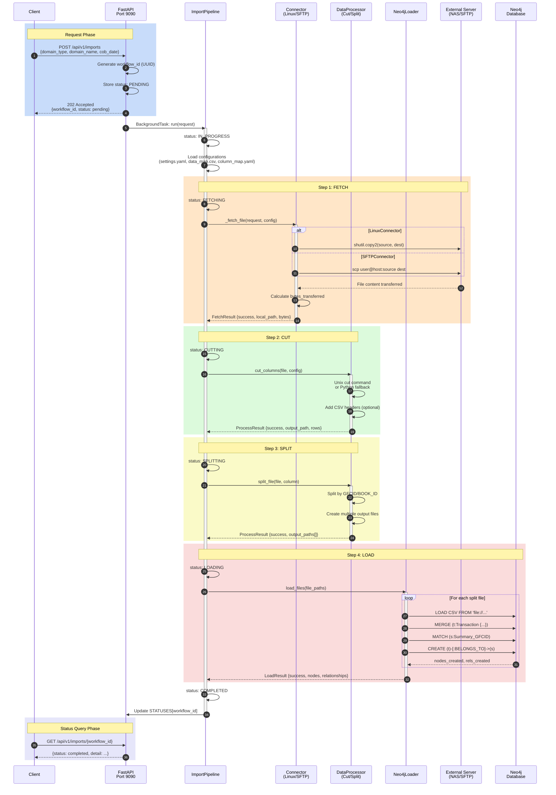
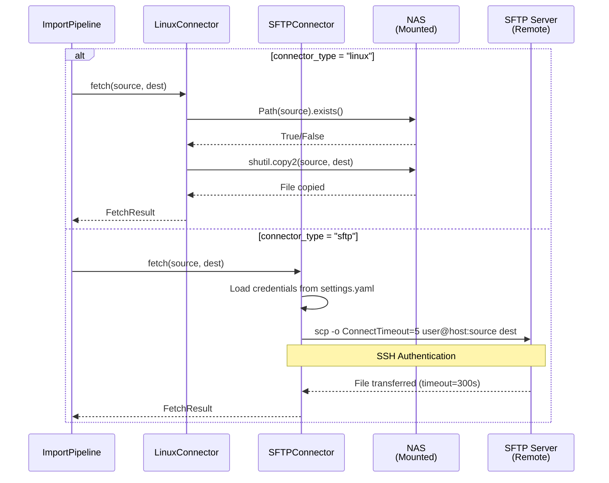
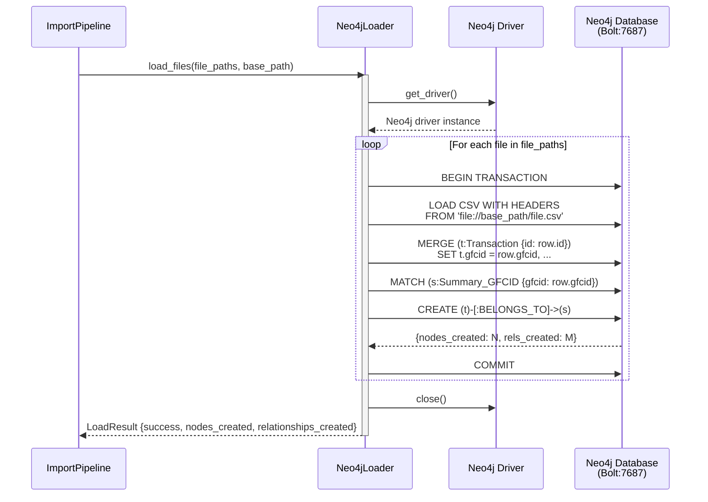
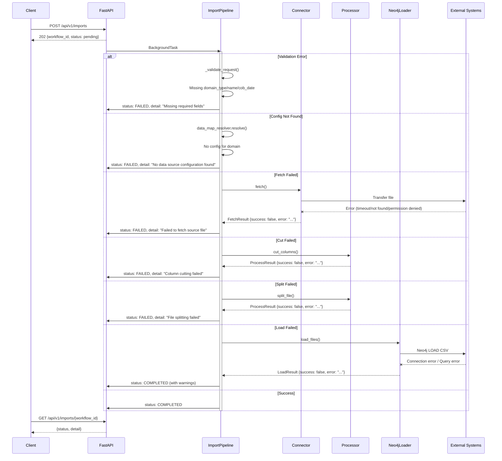
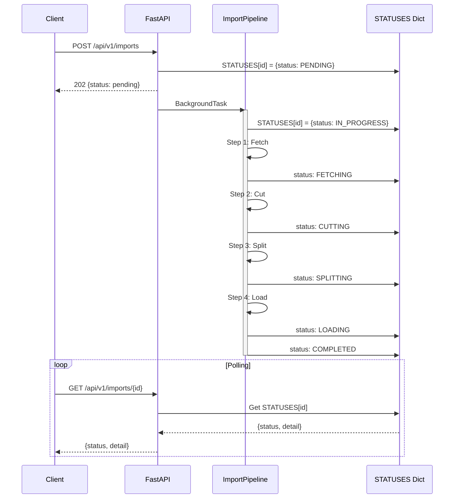

# /api/v1/imports Sequence Diagram

## Overview

This document shows the complete sequence diagrams for interactions between the `/api/v1/imports` API and all external systems.

---

## System Components

| Component | Type | Description |
|-----------|------|-------------|
| Client | External | Initiates API requests (Browser/Postman) |
| FastAPI | Internal | REST API service (Port 9090) |
| ImportPipeline | Internal | ETL workflow orchestration |
| Connector | Internal | File fetching (Linux/SFTP) |
| Processor | Internal | Data processing (Cut/Split) |
| Neo4jLoader | Internal | Data loading |
| NAS/SFTP Server | External | Source data storage |
| Neo4j Database | External | Graph database |

---

## Complete ETL Pipeline Sequence Diagram

```
┌────────┐┌────────┐┌──────────────┐┌───────────┐┌───────────┐┌───────────┐┌─────────────┐┌─────────┐
│ Client ││FastAPI ││ImportPipeline││ Connector ││ Processor ││Neo4jLoader││External     ││  Neo4j  │
│        ││        ││              ││           ││           ││           ││Server(NAS)  ││Database │
└───┬────┘└───┬────┘└──────┬───────┘└─────┬─────┘└─────┬─────┘└─────┬─────┘└──────┬──────┘└────┬────┘
    │         │            │              │            │            │             │            │
    │ POST    │            │              │            │            │             │            │
    │/imports │            │              │            │            │             │            │
    │────────>│            │              │            │            │             │            │
    │         │            │              │            │            │             │            │
    │         │BackgroundTask             │            │            │             │            │
    │         │───────────>│              │            │            │             │            │
    │         │            │              │            │            │             │            │
    │ 202     │            │              │            │            │             │            │
    │<────────│            │              │            │            │             │            │
    │         │            │              │            │            │             │            │
    │         │            │ ═══════════════════════════════════════════════════════════════  │
    │         │            │ ║                    STEP 1: FETCH                            ║  │
    │         │            │ ═══════════════════════════════════════════════════════════════  │
    │         │            │              │            │            │             │            │
    │         │            │ fetch()      │            │            │             │            │
    │         │            │─────────────>│            │            │             │            │
    │         │            │              │            │            │             │            │
    │         │            │              │ copy/scp   │            │             │            │
    │         │            │              │───────────────────────────────────────>│            │
    │         │            │              │            │            │             │            │
    │         │            │              │  file data │            │             │            │
    │         │            │              │<───────────────────────────────────────│            │
    │         │            │              │            │            │             │            │
    │         │            │ FetchResult  │            │            │             │            │
    │         │            │<─────────────│            │            │             │            │
    │         │            │              │            │            │             │            │
    │         │            │ ═══════════════════════════════════════════════════════════════  │
    │         │            │ ║                    STEP 2: CUT                              ║  │
    │         │            │ ═══════════════════════════════════════════════════════════════  │
    │         │            │              │            │            │             │            │
    │         │            │ cut_columns()│            │            │             │            │
    │         │            │─────────────────────────>│            │             │            │
    │         │            │              │            │            │             │            │
    │         │            │              │   (local disk I/O)     │             │            │
    │         │            │              │            │            │             │            │
    │         │            │ ProcessResult│            │            │             │            │
    │         │            │<─────────────────────────│            │             │            │
    │         │            │              │            │            │             │            │
    │         │            │ ═══════════════════════════════════════════════════════════════  │
    │         │            │ ║                    STEP 3: SPLIT                            ║  │
    │         │            │ ═══════════════════════════════════════════════════════════════  │
    │         │            │              │            │            │             │            │
    │         │            │ split_file() │            │            │             │            │
    │         │            │─────────────────────────>│            │             │            │
    │         │            │              │            │            │             │            │
    │         │            │              │   (local disk I/O)     │             │            │
    │         │            │              │            │            │             │            │
    │         │            │ ProcessResult│            │            │             │            │
    │         │            │<─────────────────────────│            │             │            │
    │         │            │              │            │            │             │            │
    │         │            │ ═══════════════════════════════════════════════════════════════  │
    │         │            │ ║                    STEP 4: LOAD                             ║  │
    │         │            │ ═══════════════════════════════════════════════════════════════  │
    │         │            │              │            │            │             │            │
    │         │            │ load_files() │            │            │             │            │
    │         │            │─────────────────────────────────────>│             │            │
    │         │            │              │            │            │             │            │
    │         │            │              │            │            │ LOAD CSV   │            │
    │         │            │              │            │            │────────────────────────>│
    │         │            │              │            │            │             │            │
    │         │            │              │            │            │ nodes/rels │            │
    │         │            │              │            │            │<────────────────────────│
    │         │            │              │            │            │             │            │
    │         │            │ LoadResult   │            │            │             │            │
    │         │            │<─────────────────────────────────────│             │            │
    │         │            │              │            │            │             │            │
    │         │ status:    │              │            │            │             │            │
    │         │ completed  │              │            │            │             │            │
    │         │<───────────│              │            │            │             │            │
    │         │            │              │            │            │             │            │
    │ GET     │            │              │            │            │             │            │
    │/imports/│            │              │            │            │             │            │
    │  {id}   │            │            │            │            │             │            │
    │────────>│            │              │            │            │             │            │
    │         │            │              │            │            │             │            │
    │ status  │            │              │            │            │             │            │
    │<────────│            │              │            │            │             │            │
    │         │            │              │            │            │             │            │
```

---

## Mermaid Sequence Diagram - Complete Flow



---

## External System Interaction Details

### 1. Interaction with NAS/SFTP Server



### 2. Interaction with Neo4j Database



---

## Error Handling Sequence Diagram



---

## Status Transition Sequence Diagram



---

## System Interaction Overview

```
┌─────────────────────────────────────────────────────────────────────────────────────────────────┐
│                                      EXTERNAL SYSTEMS                                            │
├─────────────────────────────────────────────────────────────────────────────────────────────────┤
│                                                                                                 │
│    ┌─────────────────┐         ┌─────────────────┐         ┌─────────────────┐                 │
│    │  NAS Storage    │         │  SFTP Server    │         │  Neo4j Database │                 │
│    │  (Mounted)      │         │  (Remote)       │         │  (Bolt:7687)    │                 │
│    │                 │         │                 │         │                 │                 │
│    │  /mnt/nas/      │         │  ssh://host:22  │         │  bolt://host    │                 │
│    └────────┬────────┘         └────────┬────────┘         └────────┬────────┘                 │
│             │                           │                           │                          │
│             │ shutil.copy2              │ scp command               │ Cypher LOAD CSV          │
│             │                           │                           │                          │
└─────────────┼───────────────────────────┼───────────────────────────┼──────────────────────────┘
              │                           │                           │
              │                           │                           │
┌─────────────┼───────────────────────────┼───────────────────────────┼──────────────────────────┐
│             │                           │                           │                          │
│             ▼                           ▼                           ▼                          │
│    ┌─────────────────────────────────────────────────────────────────────────────────────┐    │
│    │                              MICROSERVICE                                            │    │
│    ├─────────────────────────────────────────────────────────────────────────────────────┤    │
│    │                                                                                     │    │
│    │   ┌───────────────┐                                                                 │    │
│    │   │    Client     │                                                                 │    │
│    │   │  (External)   │                                                                 │    │
│    │   └───────┬───────┘                                                                 │    │
│    │           │ HTTP                                                                    │    │
│    │           ▼                                                                         │    │
│    │   ┌───────────────┐      ┌───────────────┐      ┌───────────────┐                  │    │
│    │   │   FastAPI     │─────>│ImportPipeline │─────>│   Connector   │──────────────────┼────┼──> NAS/SFTP
│    │   │  Port 9090    │      │               │      │               │                  │    │
│    │   └───────────────┘      │               │      └───────────────┘                  │    │
│    │                          │               │                                          │    │
│    │                          │               │      ┌───────────────┐                  │    │
│    │                          │               │─────>│ DataProcessor │                  │    │
│    │                          │               │      │  (Cut/Split)  │                  │    │
│    │                          │               │      └───────────────┘                  │    │
│    │                          │               │                                          │    │
│    │                          │               │      ┌───────────────┐                  │    │
│    │                          │               │─────>│  Neo4jLoader  │──────────────────┼────┼──> Neo4j
│    │                          │               │      │               │                  │    │
│    │                          └───────────────┘      └───────────────┘                  │    │
│    │                                                                                     │    │
│    │   ┌─────────────────────────────────────────────────────────────────────────────┐  │    │
│    │   │                           LOCAL STORAGE                                      │  │    │
│    │   │                         (DROPBOX_DIR)                                        │  │    │
│    │   │                                                                              │  │    │
│    │   │    [fetched.csv] ──> [cut.csv] ──> [split_1.csv] [split_2.csv] ...          │  │    │
│    │   │                                                                              │  │    │
│    │   └─────────────────────────────────────────────────────────────────────────────┘  │    │
│    │                                                                                     │    │
│    └─────────────────────────────────────────────────────────────────────────────────────┘    │
│                                                                                                 │
└─────────────────────────────────────────────────────────────────────────────────────────────────┘
```

---

## Communication Protocols and Ports

| Interaction | Protocol | Port | Authentication |
|-------------|----------|------|----------------|
| Client → FastAPI | HTTP/HTTPS | 9090 | None (internal) |
| LinuxConnector → NAS | NFS/SMB | 445/2049 | Mount credentials |
| SFTPConnector → Remote | SSH/SCP | 22 | SSH Key / Password |
| Neo4jLoader → Neo4j | Bolt | 7687 | Username/Password |

---

## Data Flow Summary

| Step | Source | Target | Data | Method |
|------|--------|--------|------|--------|
| 1 | Client | FastAPI | HTTP Request | REST API |
| 2 | FastAPI | ImportPipeline | ImportRequest | Python call |
| 3 | ImportPipeline | Connector | Config | Python call |
| 4 | Connector | NAS/SFTP | File request | copy/scp |
| 5 | NAS/SFTP | DROPBOX_DIR | File data | File transfer |
| 6 | Processor | DROPBOX_DIR | Cut file | Local I/O |
| 7 | Processor | DROPBOX_DIR | Split files | Local I/O |
| 8 | Neo4jLoader | Neo4j | CSV data | LOAD CSV |
| 9 | FastAPI | Client | HTTP Response | REST API |

---

## Related Files

| File | Description |
|------|-------------|
| `app/api/data_import.py` | API endpoint definitions |
| `app/services/import_pipeline.py` | Pipeline orchestration |
| `app/services/connectors.py` | Connector implementation |
| `app/services/processors.py` | Data processing (Cut/Split) |
| `app/services/neo4j_loader.py` | Neo4j loading |
| `conf/settings.yaml` | Configuration (DB, Server credentials) |
| `conf/data_map.csv` | Domain mapping |
| `conf/column_map.yaml` | Column mapping configuration |
